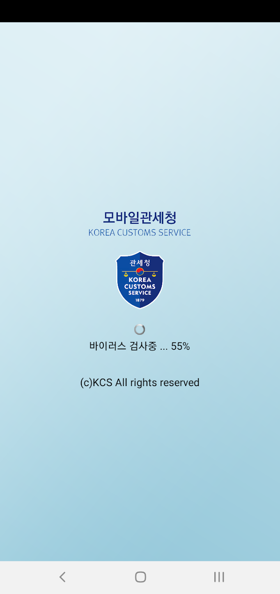
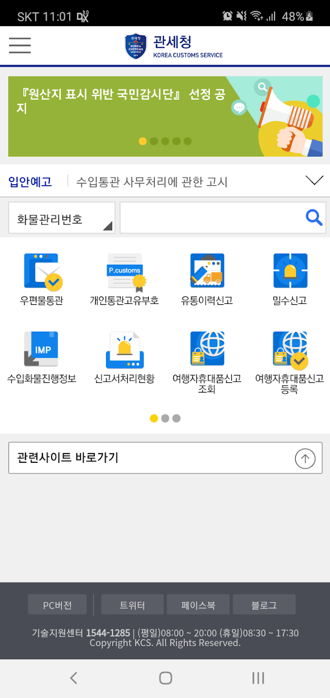
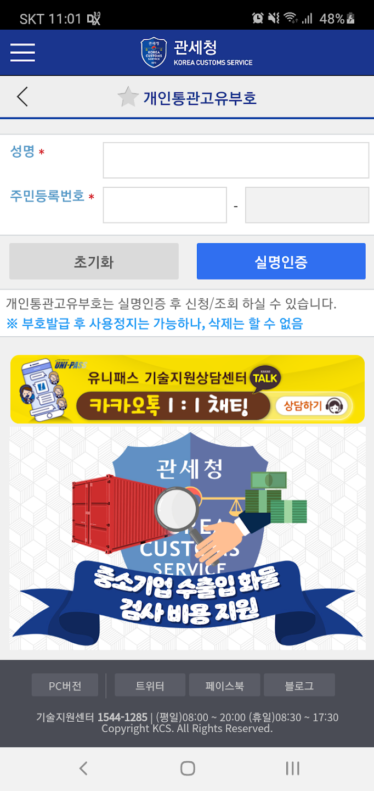
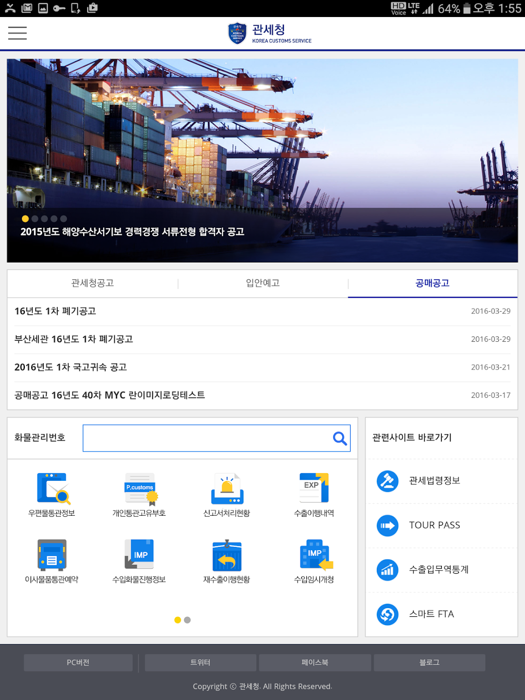
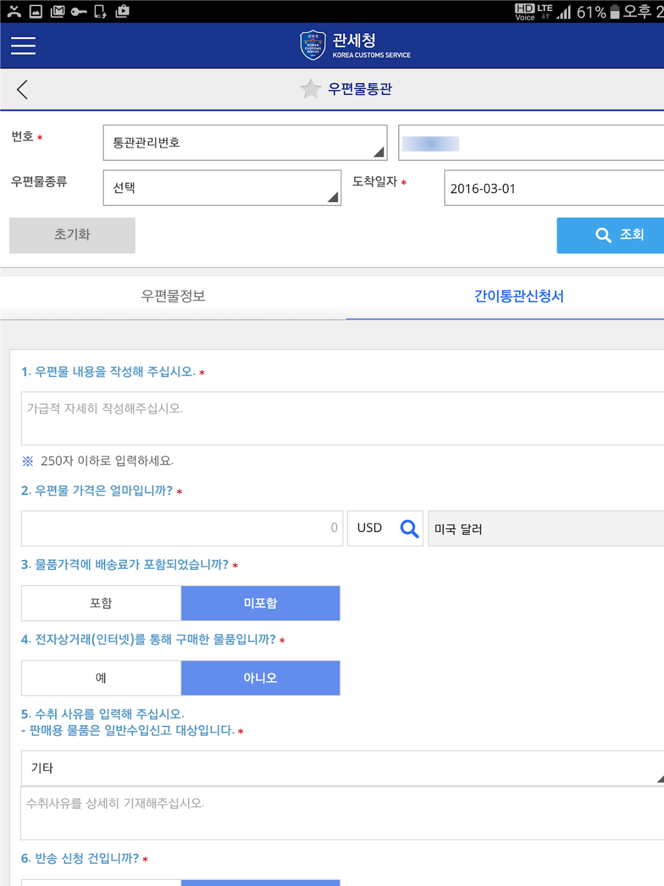

# 📦 Electronic Customs System

> 관세청 전자통관 시스템 유지보수 및 개발

---

## 📌 Overview
- 기간: 2018.09 ~ 2021.06  
- 역할: Web Developer  
- 기술: Java, JavaScript, Spring, Oracle, Hybrid App

---

## 📸 Screenshots

  
  
  
  
  

---

## 🧩 Key Features

- 전자통관 시스템 유지보수 및 기능 개발
- Oracle 기반 데이터 처리
- 모바일 하이브리드 앱 운영

---

## ⚙️ What I Did

- 데이터 처리 로직 개발
- 모바일(iOS / Android) 이슈 대응
- 시스템 안정화 작업

---

## 📈 Achievements

- 모바일 서비스 안정성 확보
- 장애 대응 속도 개선
