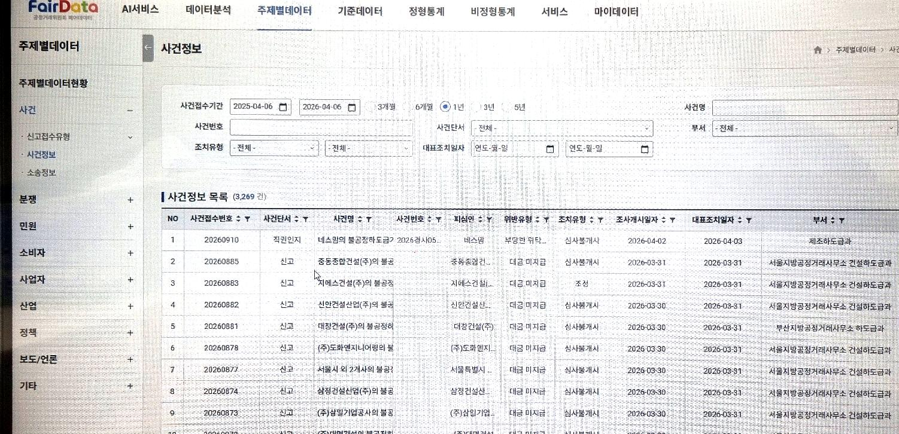
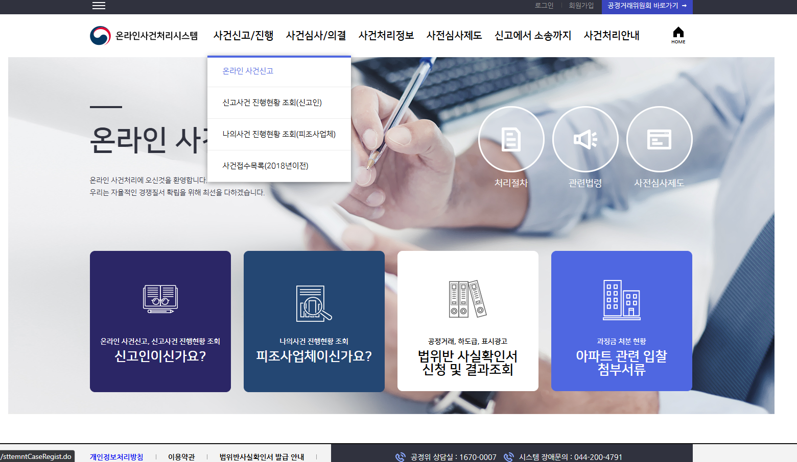
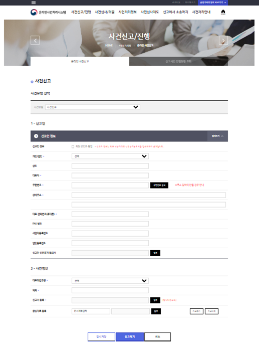

# 🏛 Fair Trade Commission Data & Case Management Platform

> 공공기관 대민 서비스 및 내부 데이터 시스템

---

## 📌 Overview
- 기간: 2021.12 ~ 2024.01  
- 역할: Full-Stack / ETL / DevOps  
- 기술: Spring Framework, JSP, Oracle, Altibase, Jenkins

---

## 📸 Screenshots

  
  
  
  

---

## 🧩 Key Features

- 온라인 사건 처리 시스템 개발
- 내부 데이터 관리 시스템 구축
- ETL 기반 데이터 처리
- Jenkins 배포 자동화

---

## ⚙️ What I Did

- 프론트 + 백엔드 통합 개발
- DB 구조 개선 및 성능 튜닝
- CI/CD 파이프라인 구축

---

## 📈 Achievements

- 배포 자동화로 운영 효율 향상
- 데이터 처리 성능 개선
