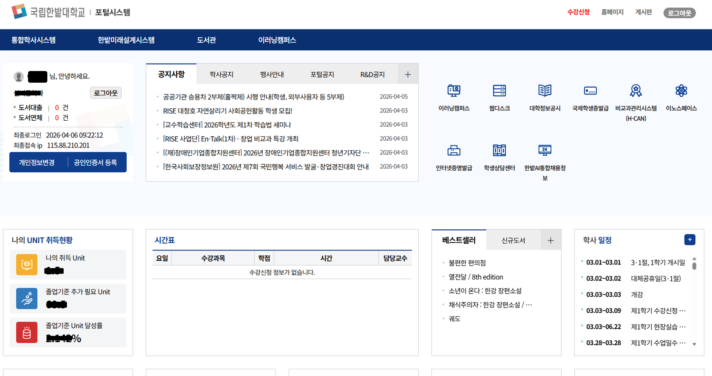
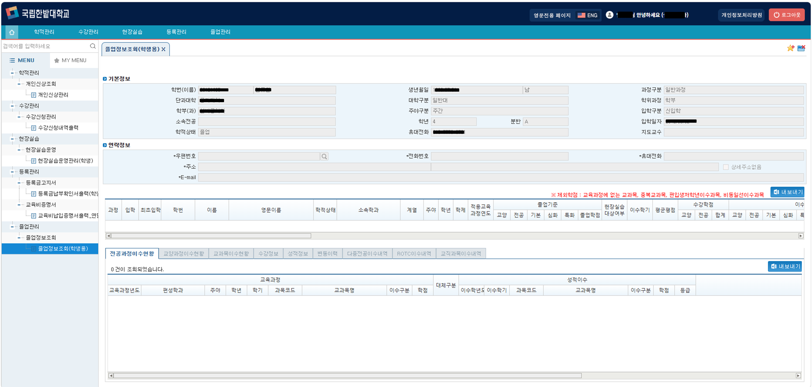

# 🎓 Hanbat National University Information System

> 한밭대학교 통합정보시스템 구축 프로젝트 (Nexacro 기반)

---

## 📌 Overview
- 기간: 2018.02 ~ 2018.08  
- 소속: WIZIAN  
- 역할: Frontend Developer  
- 기술: Nexacro, JavaScript

---

## 📸 Screenshots

  

  

---

## 🧩 Key Features

- 학사 행정 시스템 UI 개발
- 사용자 요구사항 기반 화면 설계 반영
- 데이터 조회 및 입력 화면 구현

---

## ⚙️ What I Did

- Nexacro 기반 UI 화면 개발
- 사용자 요구사항 분석 및 기능 반영
- 데이터 바인딩 및 화면 로직 구현

---

## 📈 Achievements

- 사용자 중심 UI 구현으로 시스템 사용성 향상
- 통합정보시스템 구축 프로젝트 참여 경험 확보

---

## 💡 Insight

- 공공/교육기관 시스템 개발 프로세스 경험 확보
- UI 개발 및 사용자 요구사항 반영 역량 강화
