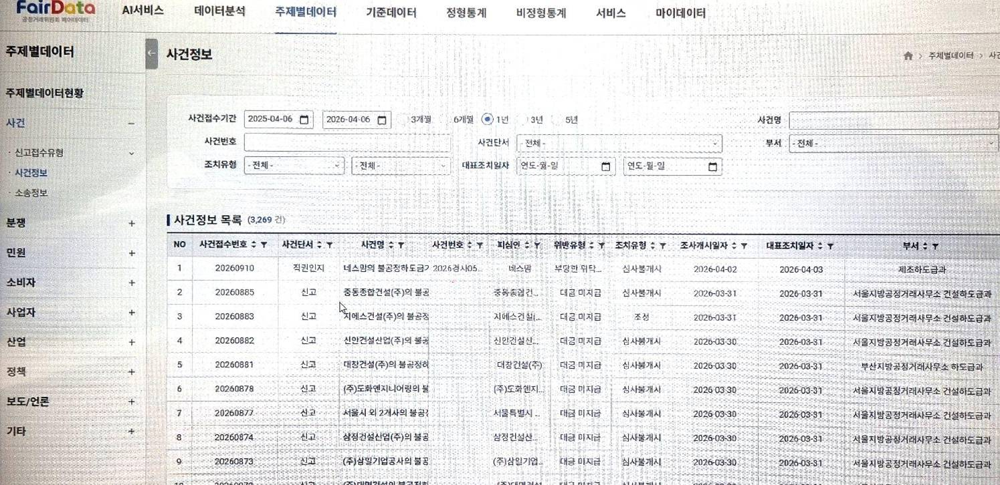
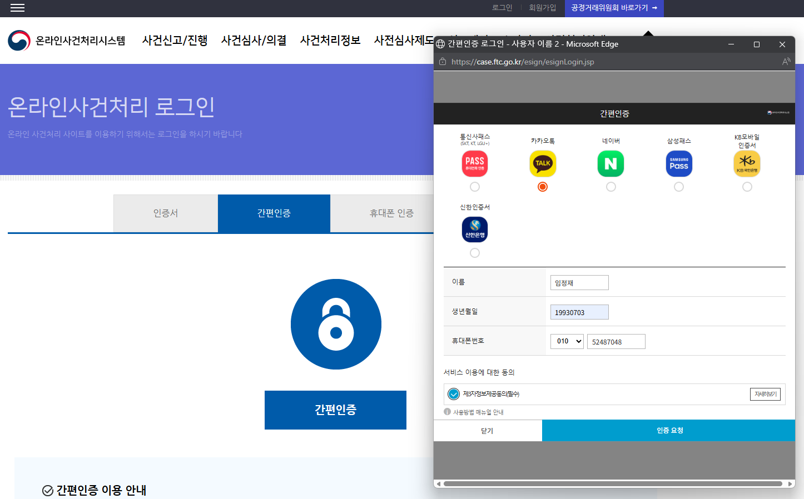

# 🏛 Fair Trade Commission Data & Case Management Platform

> 공정거래위원회 대민(온라인 사건처리) 및 대내(FairData) 데이터 통합 플랫폼

---

## 📌 Overview
- 기간: 2021.12 ~ 2024.01  
- 역할: Full-Stack / ETL / DevOps  
- 기술: Spring Framework, JSP, JavaScript, Oracle, Altibase, Jenkins  
- 개발 환경: Eclipse

---

## 📸 Screenshots

  

  
  

  

---

## 🧩 Key Features

- 공정거래위원회 **대민 온라인 사건처리 시스템 개발**
- 내부 데이터 분석 시스템(FairData) 구축
- ETL 기반 데이터 통합 및 적재 시스템 구축
- Jenkins 기반 배포 자동화

---

## ⚙️ What I Did

### 🔹 ETL 데이터 파이프라인 구축

- As-Is 다중 DB로부터 데이터 추출 및 정제
- ETL 구조 설계 및 구축 (EXT → STG1 → STG2 → ODS → DW)
- BTL DI 툴을 활용한 다이어그램 기반 ETL 개발
- 데이터 정규화 및 변환 로직 SQL 기반 설계

- STG 단계: 데이터 정제 및 변환 처리
- ODS 단계: 운영 데이터 수준 정규화
- DW 단계: 분석 및 서비스 활용 데이터 구성

- 스케줄링 기반 데이터 적재 (일/월 단위)
- 데이터 적재 상태 모니터링 및 검증

---

### 🔹 대내 시스템 (FairData)

- 데이터 조회 및 분석 화면 개발
- 백엔드 API 및 DB 연동 개발
- 데이터 구조 기반 화면 설계 반영

---

### 🔹 대민 시스템 (온라인 사건처리)

- 사건 처리 시스템 **프론트 + 백엔드 개발**
- 화면 목업 직접 설계 및 고객 컨펌 진행
- 사용자 중심 UI/UX 설계 및 구현

---

### 🔹 DevOps / 배포

- Jenkins 기반 CI/CD 구축 및 배포 자동화
- 배포 프로세스 관리 및 운영 안정성 확보

---

## 📈 Achievements

- ETL 파이프라인 구축으로 데이터 통합 체계 확립
- 데이터 정규화 및 구조 개선을 통한 품질 향상
- 대민/대내 시스템 통합으로 업무 효율성 향상
- 배포 자동화를 통한 운영 효율 향상

---

## 💡 Insight

- ETL 데이터 흐름 설계부터 서비스 개발까지 **End-to-End 경험 확보**
- 공공 대규모 데이터 시스템 운영 및 안정성 확보 경험
- 사용자 중심 설계 및 데이터 기반 서비스 구현 역량 강화
