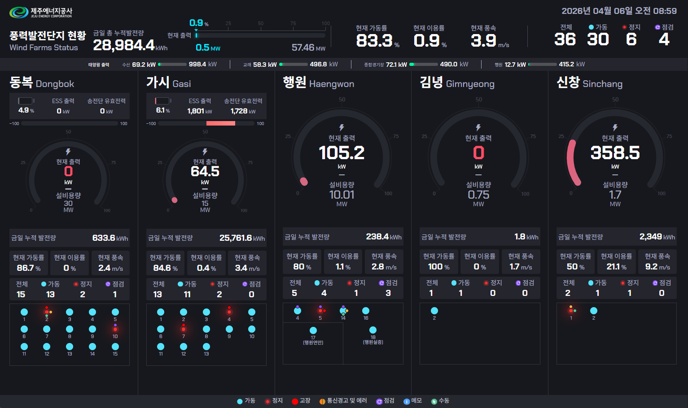
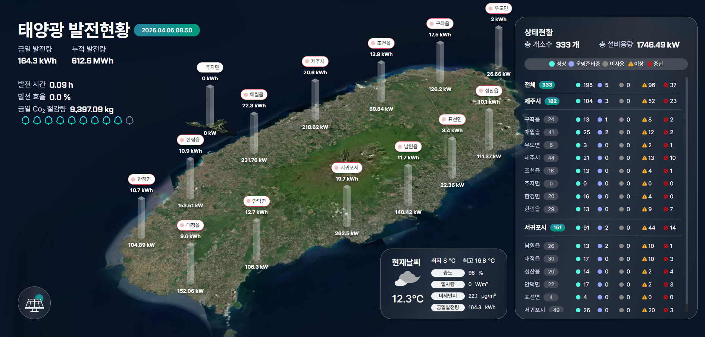
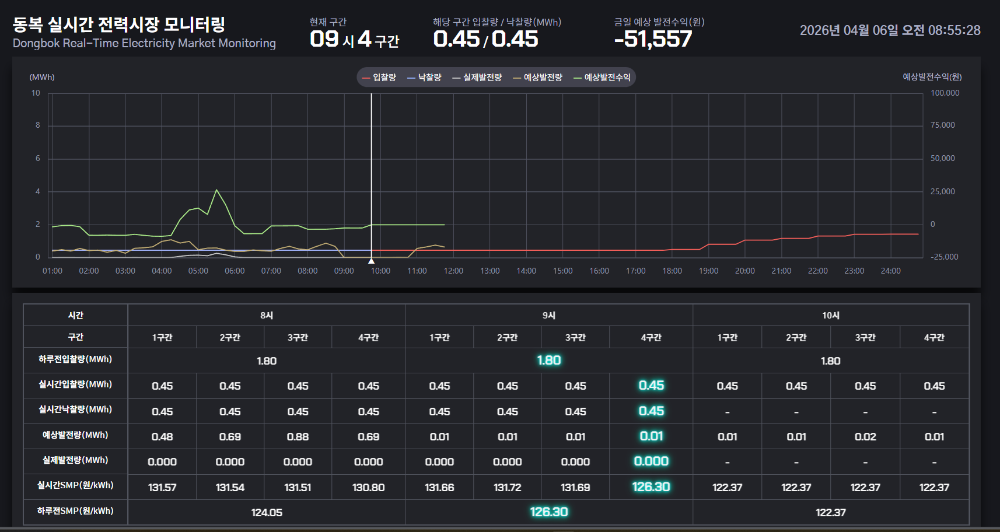

# 🌪 Wind Power Monitoring Platform

> 풍력 발전단지 통합 운영 및 설비 모니터링 시스템

---

## 📌 Overview
- 기간: 2024.04 ~ 현재  
- 역할: Backend / DevOps / 단독 개발  
- 기술: Spring Boot, MyBatis, MariaDB, REST API

---

## 📸 Screenshots

  

  

  

---

## 🧩 Key Features

- 실시간 발전량 및 설비 상태 모니터링
- 외부 API(KPX / TIS) 데이터 자동 수집
- 장애 감지 및 대응 시스템

---

## ⚙️ What I Did

- 실시간 데이터 수집 구조 설계
- API 연동 및 데이터 파이프라인 구축
- 운영 서버 배포 및 관리
- 장애 대응 프로세스 개선

---

## 📈 Achievements

- 무중단 운영 환경 유지
- 장애 대응 속도 개선
- 운영 효율 향상
